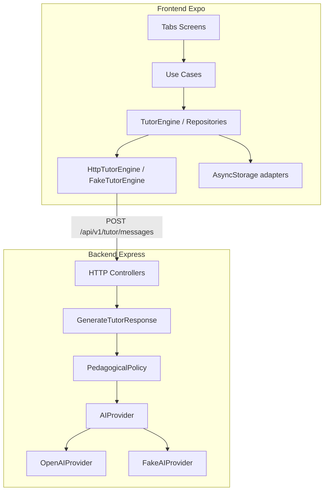

# EduIA

Tutor IA educativo para la prueba técnica de **Muyu**. Aplicación móvil (Expo / React Native) + API Express en un monorepo pnpm.

## Producto

| | |
| --- | --- |
| **Qué es** | Compañero de tutoría con IA: chat pedagógico por materia y dificultad, perfil configurable y progreso local. |
| **Audiencia** | Estudiantes y docentes (roles distintos en UI y en el tono de las respuestas). |
| **Objetivo** | Demostrar arquitectura modular, estados async robustos, IA real (OpenAI) con fallback fake, Design System y entregables listos para revisión. |

### Pantallas (P0)

| Tab | Propósito |
| --- | --- |
| **Tutor** | Chat con el tutor IA (materia, dificultad, Markdown, cancel/retry/offline). |
| **Progreso** | Métricas derivadas del historial local (sesiones, racha, actividad semanal). |
| **Perfil** | Nombre, rol, nivel, materias, estilo de explicación, tema; persistencia AsyncStorage. |

## Stack

| Capa | Tecnología |
| --- | --- |
| **Mobile** | Expo SDK 57, Expo Router, React Native, TypeScript, TanStack Query, Zustand |
| **Backend** | Express, TypeScript, Zod, Vitest (API stateless) |
| **Estilos** | NativeWind v4 + tokens semánticos + CVA (Design System propio) |
| **Testing** | Vitest (frontend + backend) |
| **Monorepo** | pnpm workspaces (`frontend/`, `backend/`) |

## Cómo ejecutar

### Requisitos

- Node.js 20+
- [pnpm](https://pnpm.io/) 10+
- [Expo Go](https://expo.dev/go) (opcional, dispositivo físico)
- Clave OpenAI (solo si usas `AI_PROVIDER=openai`)

### Instalación

```bash
pnpm install
cp frontend/.env.example frontend/.env
cp backend/.env.example backend/.env
pnpm dev
```

- **Frontend:** Metro / Expo (escanea el QR o pulsa `w` para web).
- **Backend:** `http://localhost:3001/api/v1/health`

Scripts útiles:

```bash
pnpm dev:frontend   # solo Expo
pnpm dev:backend    # solo API
pnpm lint
pnpm typecheck
pnpm test
```

### Modos de tutoría (fake vs remote vs OpenAI)

Hay **dos capas** independientes: el motor en el móvil y el proveedor de IA en el backend.

**1. Frontend — `EXPO_PUBLIC_TUTOR_MODE`**

| Valor | Comportamiento |
| --- | --- |
| `fake` | `FakeTutorEngine` local. No necesita backend ni red. Ideal para demos rápidas. |
| `remote` | `HttpTutorEngine` → `POST /api/v1/tutor/messages` en el backend. |

**2. Backend — `AI_PROVIDER`** (solo aplica con modo `remote`)

| Valor | Comportamiento |
| --- | --- |
| `fake` | Respuestas deterministas sin API key. |
| `openai` | OpenAI real (`OPENAI_API_KEY` obligatorio). Modelo por defecto: `gpt-4o-mini`. |

Ejemplos típicos:

```bash
# Demo sin red (solo móvil)
# frontend/.env
EXPO_PUBLIC_TUTOR_MODE=fake

# Backend fake (sin OpenAI)
# frontend/.env → EXPO_PUBLIC_TUTOR_MODE=remote
# backend/.env  → AI_PROVIDER=fake

# OpenAI real
# frontend/.env → EXPO_PUBLIC_TUTOR_MODE=remote
# backend/.env  → AI_PROVIDER=openai  +  OPENAI_API_KEY=sk-...
```

### Dispositivo físico (IP LAN)

`localhost` en el teléfono apunta al propio dispositivo, no a tu PC. En la misma Wi‑Fi:

1. Obtén la IP local del PC (p. ej. `192.168.1.42`).
2. En `frontend/.env`:

```bash
EXPO_PUBLIC_API_URL=http://192.168.1.42:3001
EXPO_PUBLIC_TUTOR_MODE=remote
```

3. Reinicia Metro (`pnpm dev:frontend`) y abre con Expo Go.

> Si no puedes alcanzar el backend, usa `EXPO_PUBLIC_TUTOR_MODE=fake`.

### Probar en Expo Go (sin APK)

EAS Build / APK no está configurado en P0. Camino recomendado:

1. `pnpm install` + copiar `.env.example` → `.env`
2. `pnpm dev` (o `pnpm dev:frontend` si usas fake)
3. Instala **Expo Go** en el teléfono
4. Escanea el QR del terminal Metro
5. Para IA real: backend en marcha + `EXPO_PUBLIC_TUTOR_MODE=remote` + IP LAN

## Arquitectura

Módulos por **capacidad** (`tutoring`, `learning-progress`, `user-preferences`) con DDD/hexagonal **pragmático**:

- **Dominio** sin React, Express ni SDKs de terceros.
- **Puertos** (interfaces) en application; **adaptadores** driving (HTTP/UI) y driven (OpenAI, Fake, AsyncStorage).
- **Composition root** manual: `frontend/src/bootstrap/` y `*/composition/`.
- Cada módulo expone solo su **API pública** (`index.ts`); el resto de la app importa desde ahí.
- **Design System** (`frontend/src/design-system/`): componentes P0 reutilizables sobre tokens/temas.
- **NativeWind**: utilidad de estilos (Tailwind en RN); no sustituye al DS — el DS usa NativeWind + CVA por dentro.

```text
EduIA/
├── frontend/
│   ├── src/app/(tabs)/          # Tutor / Progreso / Perfil
│   ├── src/design-system/       # Tokens, temas, componentes P0
│   ├── src/modules/             # tutoring, learning-progress, user-preferences
│   ├── src/bootstrap/           # Composition root
│   └── src/shared/              # config, http, storage, errors
└── backend/
    └── src/
        ├── modules/tutoring/    # Hexagonal: domain → use cases → adapters
        ├── modules/health/
        └── shared/
```



### API P0

| Método | Ruta | Notas |
| --- | --- | --- |
| `GET` | `/api/v1/health` | Liveness |
| `POST` | `/api/v1/tutor/messages` | Body Zod: `message`, `subject`, `difficulty`, `userRole`, `conversation` (máx. 10) |

Errores normalizados: `{ error: { code, message, retryable, requestId } }`. Timeout por defecto: `AI_REQUEST_TIMEOUT_MS=20000`.

## Decisiones y trade-offs

| Decisión | Por qué |
| --- | --- |
| **Sin auth** | Fuera del alcance P0; reduce superficie y tiempo de entrega. |
| **Sin base de datos** | Backend stateless; historial y prefs viven en el dispositivo. |
| **Historial local (AsyncStorage)** | Suficiente para progreso y demos offline; no hay sync multi-dispositivo. |
| **Backend sin streaming** | Respuesta completa por request; más simple de validar, cancelar y testear. Streaming queda en backlog. |
| **Fake siempre disponible** | Demo sin clave ni red; mismos puertos que OpenAI/HTTP. |
| **Hexagonal pragmático** | Tutoring lleva capas completas; Progress/Preferences más delgados. |
| **NativeWind + DS propio** | Velocidad de UI + componentes consistentes sin acoplar pantallas a utilidades sueltas. |

## Backlog (post-P0)

- Streaming de respuestas del tutor
- Auth (sesiones / JWT)
- Postgres + sync multi-dispositivo del historial
- Rate limiting / observabilidad en producción
- Gemini u otros proveedores de IA
- EAS Build + APK/IPA firmados
- Quizzes, audio, BottomSheet/Dialog avanzados en el DS

## Tests

```bash
# Todo el monorepo
pnpm test

# Por paquete
pnpm --filter frontend test
pnpm --filter backend test

# Typecheck
pnpm typecheck
```

Cobertura crítica: ciclo de vida del tutor (backend), persistencia de preferencias, métricas de progreso (frontend).

## Entorno (`.env`)

Plantillas sin secretos:

- [`frontend/.env.example`](frontend/.env.example)
- [`backend/.env.example`](backend/.env.example)

Nunca commits de `.env` con claves reales. Con `AI_PROVIDER=openai`, `OPENAI_API_KEY` es obligatorio.

## Capturas / video / APK

| Entregable | Estado |
| --- | --- |
| Screenshots (Tutor / Progreso / Perfil) | _Pendiente — añadir capturas aquí o en `docs/screenshots/`_ |
| Video demo (flujo completo) | _Pendiente — enlace o archivo_ |
| APK | _No incluido en P0; usar Expo Go (ver arriba)_ |

## Entrega

### Ramas

- Desarrollo diario en `feature/*` → merge a `develop`
- Entrega: `develop` (y `main` alineado cuando esté listo)

### Colaborador GitHub (`AlbertoOrrantia`)

Si el repo ya está en GitHub con `origin` y `gh` autenticado:

```bash
# Sustituye OWNER/REPO por el remoto real
gh api repos/OWNER/REPO/collaborators/AlbertoOrrantia -X PUT -f permission=push
```

O desde la UI: **Settings → Collaborators → Add people → `AlbertoOrrantia`**.

Si aún no hay remoto:

```bash
# Crear repo y publicar (ejemplo)
gh repo create EduIA --private --source=. --remote=origin --push
git push -u origin develop
git push -u origin main
gh api repos/$(gh repo view --json nameWithOwner -q .nameWithOwner)/collaborators/AlbertoOrrantia -X PUT -f permission=push
```

## Licencia / contexto

Prueba técnica Muyu — uso educativo / evaluación.

