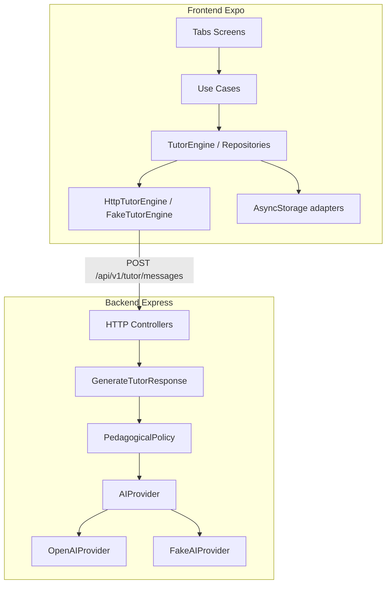

# EduIA

Aplicación móvil de tutoría educativa desarrollada como prueba técnica para Muyu Education.

El proyecto incluye una aplicación en React Native con Expo y una API en Node.js con Express, organizados como monorepo con pnpm. La aplicación permite interactuar con un tutor educativo asistido por IA, configurar preferencias de usuario y consultar métricas derivadas de la actividad local.

La solución prioriza el flujo principal del producto, el manejo de estados asíncronos, la consistencia visual y la separación entre reglas de aplicación e integraciones externas.

## Funcionalidades implementadas

- **Tutor IA:** chat pedagógico por materia y dificultad, renderizado Markdown, cancelación, reintento y manejo de estados offline/error.
- **Preferencias de usuario:** nombre, rol (estudiante/docente), nivel, materias, estilo de explicación y tema, con persistencia local.
- **Progreso:** métricas derivadas del historial de sesiones en el dispositivo (actividad, racha y resumen semanal).
- **Modos de ejecución:** motor local (`fake`) para demos sin red, o integración remota con la API Express (`remote`) y proveedor OpenAI o fake en backend.

## Tecnologías

| Capa | Tecnología |
| --- | --- |
| **Mobile** | Expo SDK 57, Expo Router, React Native, TypeScript, TanStack Query, Zustand |
| **Backend** | Express, TypeScript, Zod, Vitest |
| **Estilos** | NativeWind v4, tokens semánticos, CVA |
| **Testing** | Vitest (frontend y backend) |
| **Monorepo** | pnpm workspaces (`frontend/`, `backend/`) |

## Requisitos

- Node.js 20+
- [pnpm](https://pnpm.io/) 10+
- Expo Go o un emulador compatible (iOS / Android)
- Clave OpenAI solo si se usa `AI_PROVIDER=openai`

## Instalación y ejecución

```bash
pnpm install
cp frontend/.env.example frontend/.env
cp backend/.env.example backend/.env
pnpm dev
```

- **Frontend:** Metro / Expo.
- **Backend:** `http://localhost:3001/api/v1/health`

Scripts útiles:

```bash
pnpm dev:frontend   # solo Expo
pnpm dev:backend    # solo API
pnpm lint
pnpm typecheck
pnpm test
```

### Ejecución de la aplicación móvil

La aplicación puede ejecutarse mediante Expo Go o un emulador compatible.

Después de iniciar el frontend:

```bash
pnpm dev:frontend
```

Escanea el código QR generado por Metro desde Expo Go.

Para utilizar la integración real con IA, el dispositivo debe poder conectarse a la API Express. En un dispositivo físico, configura `EXPO_PUBLIC_API_URL` con la dirección IP local del equipo donde se ejecuta el backend.

## Configuración de variables de entorno

Plantillas sin secretos:

- [`frontend/.env.example`](frontend/.env.example)
- [`backend/.env.example`](backend/.env.example)

### Frontend — `EXPO_PUBLIC_TUTOR_MODE`

| Valor | Comportamiento |
| --- | --- |
| `fake` | `FakeTutorEngine` local. No requiere backend ni red. |
| `remote` | `HttpTutorEngine` → `POST /api/v1/tutor/messages` |

`EXPO_PUBLIC_API_URL` define la base de la API (sin slash final). Ejemplos:

```bash
# Simulador / web
EXPO_PUBLIC_API_URL=http://localhost:3001

# Emulador Android
EXPO_PUBLIC_API_URL=http://10.0.2.2:3001

# Dispositivo físico (misma Wi‑Fi)
EXPO_PUBLIC_API_URL=http://192.168.1.42:3001
EXPO_PUBLIC_TUTOR_MODE=remote
```

### Backend — `AI_PROVIDER`

Aplica cuando el frontend usa `remote`:

| Valor | Comportamiento |
| --- | --- |
| `fake` | Respuestas deterministas sin API key. |
| `openai` | OpenAI real (`OPENAI_API_KEY` obligatorio). Modelo por defecto: `gpt-4o-mini`. |

```bash
# Demo sin red (solo móvil)
EXPO_PUBLIC_TUTOR_MODE=fake

# Backend fake (sin OpenAI)
EXPO_PUBLIC_TUTOR_MODE=remote
AI_PROVIDER=fake

# OpenAI real
EXPO_PUBLIC_TUTOR_MODE=remote
AI_PROVIDER=openai
OPENAI_API_KEY=sk-...
```

No versiones archivos `.env` con claves reales.

## Arquitectura

Módulos por capacidad (`tutoring`, `learning-progress`, `user-preferences`) con un enfoque hexagonal pragmático:

- Dominio independiente de React, Express y SDKs de terceros.
- Puertos en application; adaptadores driving (HTTP/UI) y driven (OpenAI, Fake, AsyncStorage).
- Composition root manual en `frontend/src/bootstrap/` y en `*/composition/`.
- Cada módulo expone su API pública vía `index.ts`.

```text
EduIA/
├── frontend/
│   ├── src/app/(tabs)/          # Tutor / Progreso / Perfil
│   ├── src/design-system/       # Tokens, temas, componentes
│   ├── src/modules/             # tutoring, learning-progress, user-preferences
│   ├── src/bootstrap/           # Composition root
│   └── src/shared/              # config, http, storage, errors
└── backend/
    └── src/
        ├── modules/tutoring/    # domain → use cases → adapters
        ├── modules/health/
        └── shared/
```



## Design System

Ubicado en `frontend/src/design-system/`:

- Tokens semánticos (color, tipografía, spacing, radius, layout) y temas claro/oscuro.
- Componentes reutilizables construidos con NativeWind + CVA (`AppButton`, `AppInput`, `AppScreen`, `AppHeader`, `AppSelect`, estados vacíos/error, toasts, sheets, etc.).
- Las pantallas consumen el Design System; NativeWind no sustituye al sistema de componentes.

## Manejo de estado

- **TanStack Query:** carga y mutaciones del tutor, sesiones recientes y sincronización con repositorios.
- **Zustand:** preferencias de UI/sesión en memoria, hidratadas desde AsyncStorage.
- **Persistencia local:** historial de conversaciones y preferencias en AsyncStorage; el backend es stateless.

## API

| Método | Ruta | Descripción |
| --- | --- | --- |
| `GET` | `/api/v1/health` | Liveness |
| `POST` | `/api/v1/tutor/messages` | Genera respuesta del tutor |

Body validado con Zod: `message`, `subject`, `difficulty`, `userRole`, `conversation` (máximo 10 mensajes).

Errores normalizados:

```json
{
  "error": {
    "code": "string",
    "message": "string",
    "retryable": true,
    "requestId": "string"
  }
}
```

Timeout por defecto: `AI_REQUEST_TIMEOUT_MS=20000`.

## Seguridad

- `helmet`, CORS configurable y `x-powered-by` deshabilitado.
- Validación de entrada con Zod y límite de payload JSON (`32kb`).
- Rate limiting en la ruta del tutor (`TUTOR_RATE_LIMIT_*`).
- Timeouts en llamadas al proveedor de IA.
- Política pedagógica en dominio para acotar el tono y el alcance de las respuestas.
- Secretos solo vía variables de entorno; nunca en el repositorio.

## Pruebas

```bash
pnpm test
pnpm --filter frontend test
pnpm --filter backend test
pnpm typecheck
```

Cobertura crítica: ciclo de vida del tutor (backend), persistencia de preferencias y métricas de progreso (frontend).

## Decisiones técnicas

| Decisión | Motivo |
| --- | --- |
| Backend sin autenticación | Reduce alcance y superficie; el flujo prioritario es la tutoría. |
| Backend sin base de datos | API stateless; historial y preferencias viven en el dispositivo. |
| Historial en AsyncStorage | Suficiente para progreso local y uso offline. |
| Respuesta completa (sin streaming) | Simplifica validación, cancelación y pruebas. |
| Proveedor fake siempre disponible | Permite revisar el producto sin red ni API key. |
| Hexagonal pragmático | Tutoring con capas completas; Progress/Preferences más delgados. |
| NativeWind + Design System propio | Velocidad de UI con componentes consistentes. |

## Limitaciones conocidas

- No hay autenticación ni multi-usuario.
- No hay sincronización multi-dispositivo del historial.
- La API no transmite respuestas en streaming.
- En dispositivo físico, `localhost` no alcanza el backend del PC: hace falta la IP LAN o el modo `fake`.

## Mejoras futuras

- Streaming de respuestas del tutor
- Autenticación y sesiones
- Persistencia en servidor y sync multi-dispositivo
- Observabilidad y límites más finos en producción
- Proveedores de IA adicionales
- Builds firmados para distribución nativa
- Extensiones de producto (quizzes, audio) y componentes avanzados del Design System
