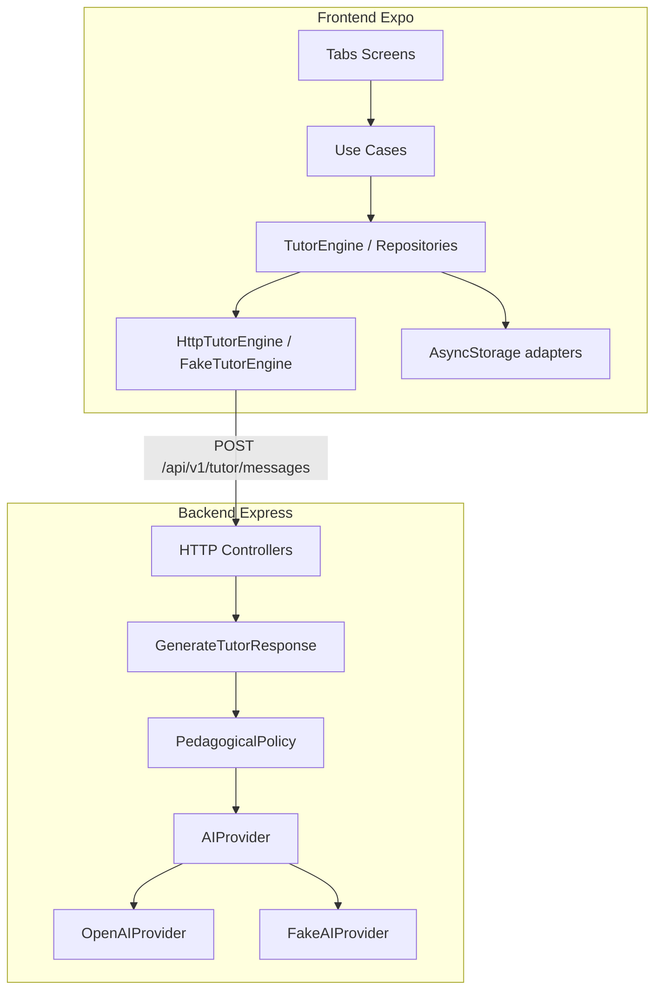

# Explanation: arquitectura

Por qué EduIA está organizado así. Para el contrato HTTP usa [reference/api.md](../reference/api.md). Para decisiones formales, [adr/](../adr/).

## Enfoque

Módulos por capacidad (`tutoring`, `learning-progress`, `user-preferences`) con **hexagonal pragmático**:

- Dominio independiente de React, Express y SDKs de terceros.
- Puertos en application; adaptadores driving (HTTP/UI) y driven (OpenAI, Fake, AsyncStorage).
- Composition root manual en `frontend/src/bootstrap/` y en `*/composition/`.
- Cada módulo expone su API pública vía `index.ts` (ver `README.md` del módulo).

Tutoring lleva capas completas; Progress y Preferences son más delgados (ver [ADR 0002](../adr/0002-hexagonal-pragmatic.md)).

## Árbol relevante

```text
EduIA/
├── frontend/
│   ├── src/app/(tabs)/          # Tutor / Progreso / Perfil
│   ├── src/design-system/       # Tokens, temas, componentes
│   ├── src/modules/             # tutoring, learning-progress, user-preferences
│   ├── src/bootstrap/           # Composition root
│   └── src/shared/              # config, http, storage, errors
└── backend/
    └── src/
        ├── modules/tutoring/    # domain → use cases → adapters
        ├── modules/health/
        └── shared/
```

## Flujo runtime



## Estado y persistencia

- **TanStack Query:** carga y mutaciones del tutor, sesiones recientes.
- **Zustand:** preferencias de UI/sesión en memoria, hidratadas desde AsyncStorage.
- **Persistencia local:** historial y preferencias en AsyncStorage; el backend es **stateless** ([ADR 0001](../adr/0001-stateless-api.md)).

## Limitaciones conscientes

- Sin autenticación ni multi-usuario.
- Sin sync multi-dispositivo del historial.
- Sin streaming de respuestas del tutor ([ADR 0003](../adr/0003-no-streaming-responses.md)).
- En dispositivo físico, `localhost` no alcanza el PC: IP LAN o modo `fake`.
