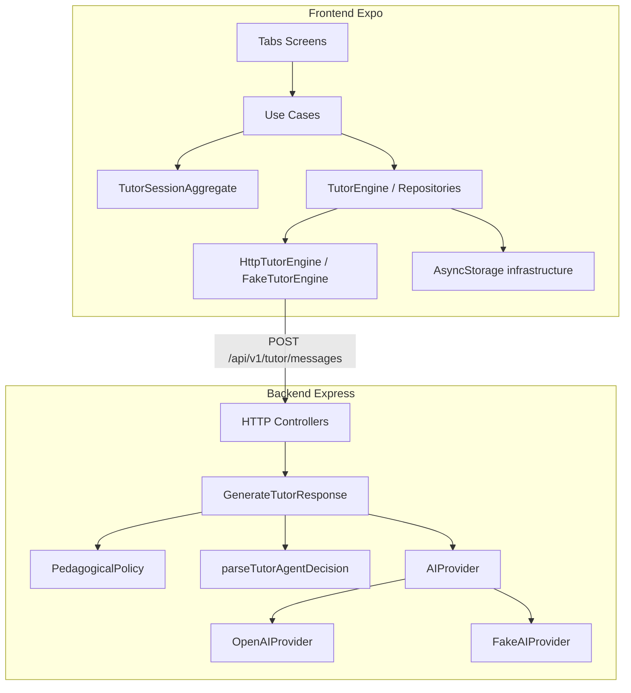

# Explanation: arquitectura

Por qué EduIA está organizado así. Para el contrato HTTP usa [reference/api.md](../reference/api.md). Para decisiones formales, [adr/](../adr/).

## Enfoque: DDD + hexagonal

Módulos por capacidad (`tutoring`, `learning-progress`, `user-preferences`) = **bounded contexts** ligeros.

| Pregunta | Respuesta en EduIA |
| --- | --- |
| ¿Qué conceptos y reglas tiene el negocio? | **DDD** → `domain/` |
| ¿Cómo evitamos que dependan de la tecnología? | **Hexagonal** → `application/` + `infrastructure/` |
| ¿Quién cablea Fake vs Remote/OpenAI? | **Composition root** → `composition/` + `bootstrap/` |

Por módulo:

```text
domain/           # entidades, VOs, policies/services, eventos (records)
application/      # use cases + ports
infrastructure/   # HTTP, Fake, AsyncStorage, Express inbound
composition/      # wiring
ui/               # presentation (FE) — adaptador de entrada
```

- Dominio independiente de React, Express y SDKs de terceros.
- Puertos en **application**; implementaciones en **infrastructure**.
- Vocabulario compartido (`Subject`, `Difficulty`, `UserRole`, …) en `frontend/src/shared/domain/` (**shared kernel** DDD).
- API pública del módulo solo vía `index.ts` (regla ESLint en frontend).

**Tutoring** tiene DDD más rico (`TutorSessionAggregate`, policies, domain events como records sin bus). **Progress** concentra reglas en un domain service puro. **Preferences** normaliza/valida en dominio; el repo solo persiste. Ver [ADR 0002](../adr/0002-hexagonal-pragmatic.md).

## SOLID y patrones (pragmático)

| Principio / patrón | Dónde se ve |
| --- | --- |
| DIP + Port/Adapter | `TutorEngine`, `AIProvider`, repositorios en `application/ports` |
| Strategy | Fake vs Http / OpenAI vía composition root |
| Composition Root | `bootstrap/app-dependencies.ts`, `composeTutoring` |
| Aggregate | `TutorSessionAggregate` (FE) |
| Policy / domain service | `PedagogicalPolicy`, follow-up/scope policies, `computeProgressSummary` |
| Repository | conversaciones y preferencias en AsyncStorage |
| Anti-corruption | `ListRecentSessions` (progress → tutoring DTOs) |

HTTP status de errores de aplicación se deriva en el edge (`HttpStatusByErrorCode`), no en los use cases. Fake AI usa `GenerateCompletionInput.context` (no parsea el system prompt).

## Árbol relevante

```text
EduIA/
├── frontend/
│   ├── src/app/(tabs)/          # Tutor / Progreso / Perfil
│   ├── src/design-system/       # Tokens, temas, componentes
│   ├── src/modules/             # tutoring, learning-progress, user-preferences
│   │     └── <module>/
│   │           domain/ | application/ | infrastructure/ | composition/ | ui/
│   ├── src/bootstrap/           # Composition root de app
│   └── src/shared/domain/       # Shared kernel (perfil tutor)
└── backend/
    └── src/
        ├── modules/tutoring/    # domain → application → infrastructure
        ├── modules/health/
        └── shared/
```

## Flujo runtime



## Estado y persistencia

- **TanStack Query:** carga y mutaciones del tutor, sesiones recientes.
- **Zustand:** preferencias de UI/sesión en memoria, hidratadas desde AsyncStorage.
- **Persistencia local:** historial y preferencias en AsyncStorage como **snapshots** JSON; el backend es **stateless** ([ADR 0001](../adr/0001-stateless-api.md)).
- El agregado de sesión vive en el dispositivo; el backend es el contexto de **generación pedagógica**, no de persistencia de chat.

## Limitaciones conscientes

- Sin autenticación ni multi-usuario.
- Sin sync multi-dispositivo del historial.
- Sin streaming de respuestas del tutor ([ADR 0003](../adr/0003-no-streaming-responses.md)).
- Sin event bus (eventos de dominio solo como records en el agregado de tutoring).
- En dispositivo físico, `localhost` no alcanza el PC: IP LAN o modo `fake`.
